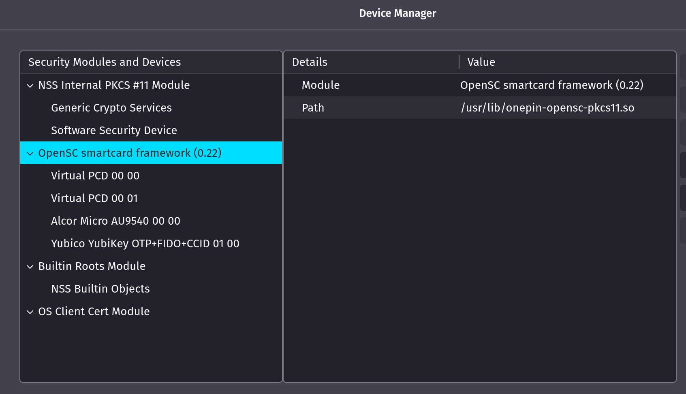

# linux-cac-walkthrough
Notes on using a CAC/PIV for PopOS!


## Software Dependencies:

### Middleware:

    pcsc-tools
    libccid
    libpcsc-perl
    libpcsclite1
    pcscd
    vsmartcard-vpcd


### Software

    opensc
    opensc-pkcs11


### Rundown

Some important setup information. Most guides will direct your towards CoolKey or CACKey as the pkcs11 management software to interact with your CAC. CoolKey used to be very effective but it cannot interact with the PIV certificates on your CAC; CACKey has the distinguishment of only being available to download after already being authenticated via CAC… also it’s just not very good. This leaves us with OpenSC. OpenSC is the bee’s knees, it can interact with PIV certificates, is very actively updated, RedHat provides upstream commits, and is very fast! CACKey and CoolKey must be completely uninstalled.

The latest version of OpenSC on the Debian repositories is v0.21. I personally have had trouble with this version so I built and installed v0.22 from source from their github page. You can follow those instructions at the following link: https://github.com/OpenSC/OpenSC/wiki/Compiling-and-Installing-on-Unix-flavors

**This should be a later attempt at trouble shooting unless you enjoy building from source**

The following command will get you up and running as far as dependencies go:

    sudo apt remove cackey coolkey libckyapplet1 libckyapplet1-dev -y && sudo apt purge -y 

    sudo apt update -y && sudo apt upgrade -y && sudo apt install pcsc-tools libccid libpcsc-perl libpcsclite1 pcscd opensc opensc-pkcs11 vsmartcard-vpcd -y

### Checks

Now that all your dependencies are installed it’s time to start checking if things are operating how they should. The first step is to ensure your middleware actually sees your CAC; this is done via pcscd and it’s associated tools.

Running pcsc_scan should give the following output:
```bash
    pcsc_scan
    Using reader plug n play mechanism
    Scanning present readers...
    0: Virtual PCD 00 00
    1: Virtual PCD 00 01
    2: Alcor Micro AU9540 00 00
    3: Yubico YubiKey OTP+FIDO+CCID 01 00
    
    Tue Sep 28 10:10:57 2021
    Reader 0: Virtual PCD 00 00
    Event number: 0
    Card state: Card removed, 
    Reader 1: Virtual PCD 00 01
    Event number: 0
    Card state: Card removed, 
    Reader 2: Alcor Micro AU9540 00 00
    Event number: 7
    Card state: Card inserted, Shared Mode, 
    ATR: 3B DB 96 00 80 1F 03 00 31 C0 64 B0 F3 10 00 07 90 00 80

    ATR: 3B DB 96 00 80 1F 03 00 31 C0 64 B0 F3 10 00 07 90 00 80
    + TS = 3B --> Direct Convention
    + T0 = DB, Y(1): 1101, K: 11 (historical bytes)
    TA(1) = 96 --> Fi=512, Di=32, 16 cycles/ETU
        250000 bits/s at 4 MHz, fMax for Fi = 5 MHz => 312500 bits/s
    TC(1) = 00 --> Extra guard time: 0
    TD(1) = 80 --> Y(i+1) = 1000, Protocol T = 0 
    -----
    TD(2) = 1F --> Y(i+1) = 0001, Protocol T = 15 - Global interface bytes following 
    -----
    TA(3) = 03 --> Clock stop: not supported - Class accepted by the card: (3G) A 5V B 3V 
    + Historical bytes: 00 31 C0 64 B0 F3 10 00 07 90 00
    Category indicator byte: 00 (compact TLV data object)
        Tag: 3, len: 1 (card service data byte)
        Card service data byte: C0
            - Application selection: by full DF name
            - Application selection: by partial DF name
            - EF.DIR and EF.ATR access services: by GET RECORD(s) command
            - Card with MF
        Tag: 6, len: 4 (pre-issuing data)
        Data: B0 F3 10 00
        Mandatory status indicator (3 last bytes)
        LCS (life card cycle): 07 (Operational state (activated))
        SW: 9000 (Normal processing.)
    + TCK = 80 (correct checksum)

    Possibly identified card (using /usr/share/pcsc/smartcard_list.txt):
    3B DB 96 00 80 1F 03 00 31 C0 64 B0 F3 10 00 07 90 00 80
        DoD CAC, Oberthur ID One 128 v5.5 Dual
```

If you get different output first check if the daemon is actually running:
```bash
    sudo systemctl status pcscd.s*

    ● pcscd.service - PC/SC Smart Card Daemon
        Loaded: loaded (/lib/systemd/system/pcscd.service; indirect; vendor preset: enabled)
        Active: active (running) since Sun 2021-09-26 20:37:17 EDT; 1 day 13h ago
    TriggeredBy: ● pcscd.socket
        Docs: man:pcscd(8)
    Main PID: 2022 (pcscd)
        Tasks: 11 (limit: 37695)
        Memory: 2.6M
        CGroup: /system.slice/pcscd.service
                └─2022 /usr/sbin/pcscd --foreground --auto-exit

    Sep 26 21:43:14 pop-os pcscd[2022]: 12411648 ifdwrapper.c:477:IFDControl() Card not transacted: 606
    Sep 26 21:43:14 pop-os pcscd[2022]: 00000112 ifdwrapper.c:477:IFDControl() Card not transacted: 606
    Sep 26 22:02:58 pop-os pcscd[2022]: 99999999 ifdwrapper.c:477:IFDControl() Card not transacted: 606
    Sep 26 22:02:58 pop-os pcscd[2022]: 00000065 ifdwrapper.c:477:IFDControl() Card not transacted: 606
    Sep 26 22:09:01 pop-os pcscd[2022]: 99999999 ifdwrapper.c:477:IFDControl() Card not transacted: 606
    Sep 26 22:09:01 pop-os pcscd[2022]: 00000181 ifdwrapper.c:477:IFDControl() Card not transacted: 606
    Sep 26 22:55:15 pop-os pcscd[2022]: 99999999 ifdwrapper.c:477:IFDControl() Card not transacted: 606
    Sep 26 22:55:15 pop-os pcscd[2022]: 00000256 ifdwrapper.c:477:IFDControl() Card not transacted: 606
    Sep 27 11:07:28 pop-os pcscd[2022]: 99999999 ifdwrapper.c:477:IFDControl() Card not transacted: 606
    Sep 27 11:07:28 pop-os pcscd[2022]: 00000068 ifdwrapper.c:477:IFDControl() Card not transacted: 606

    ● pcscd.socket - PC/SC Smart Card Daemon Activation Socket
        Loaded: loaded (/lib/systemd/system/pcscd.socket; enabled; vendor preset: enabled)
        Active: active (running) since Sun 2021-09-26 20:37:12 EDT; 1 day 13h ago
    Triggers: ● pcscd.service
        Listen: /run/pcscd/pcscd.comm (Stream)
        Tasks: 0 (limit: 37695)
        Memory: 0B
        CGroup: /system.slice/pcscd.socket

    Sep 26 20:37:12 pop-os systemd[1]: Listening on PC/SC Smart Card Daemon Activation Socket.
```

If there are errors restart the daemon:
```bash
    sudo systemctl restart pcscd.socket && sudo systemctl restart pcscd.service
```    
The last trouble shooting tip is to execute the following command; this will unload the kernel modules and allow whatever is plugged into the usb slot to claim the usb slot. This is generally only useful if you get the following message from the `pcsc_scan`: "scanning present readers waiting for the first reader..."

	modprobe -r pn533 nfc

Now that the middleware is operational we can pivot to unlocking and interacting with our CAC. First use `opensc-tools` to query some information about your CAC; the following command will list driver information available to OpenSC and if OpenSC can interact with the middleware. **This is important and probably the largest stumbling block!**:
```bash
    opensc-tool -l
    # Detected readers (pcsc)
    Nr.  Card  Features  Name
    0    No              Virtual PCD 00 00
    1    No              Virtual PCD 00 01
    2    Yes             Alcor Micro AU9540 00 00
    3    Yes             Yubico YubiKey OTP+FIDO+CCID 01 00
---------------------------------------------------------
    opensc-tool -D
    Available card drivers:
    cac              Common Access Card (CAC)
```
If your CAC reader is not listed under `Detected readers (pcsc)` there is a problem between OpenSC and pcscd. I do not know of any trouble shooting steps for a problem here except reading the source and reinstalling.

If you do not see the cac drivers under `Available card drivers` then we need to force OpenSC to use them. I've found that OpenSC on PopOS generally has this problem but thankfully it's super easy to fix.

Edit `/etc/opensc/opensc.conf` and add the following lines:

    card_drivers = cac
	force_card_driver = cac

So your `opensc.conf` should look like this:

```bash
    cat opensc.conf
    app default {
        # debug = 3;
        # debug_file = opensc-debug.txt;
        card_drivers = cac
        force_card_driver = cac
        framework pkcs15 {	
        # use_file_caching = true;
        }
    }
```

Query your CAC with opensc-tools again and see if it detects the drivers.

Now we can start working on the certificates and preparing the browers to use your CAC.

## Browser Configuration

I will show instructions on how to prepare both FireFox and Microsoft Edge (Chromium) on PopOS!

Download the DoD certificates and unzip them:

https://public.cyber.mil/pki-pke/pkipke-document-library/

This command will obviously have to be updated as Cyber.mil continuously releases new bundles and moves them around on their website:

    wget https://dl.dod.cyber.mil/wp-content/uploads/pki-pke/zip/certificates_pkcs7_DoD.zip && unzip certificates+pkcs7_DoD.zip


#### FireFox

##### Load Security Device

Load the proper security device on FireFox:

There are two ways to register the security device with Firefox, a manual and automatic way. I recommend the automatic way:
```bash
    pkcs11-register
```
Navigate to Edit -> Preference -> Advanced -> Certificates -> Security Devices. You should see the following entry under modules and devices:




If you installed your OpenSC from source then the path to your `onepin-opensc-pkcs11.so` will be exactly as mine. If you installed OpenSC from the PopOS! package manager the path will be `/usr/lib/x86_64-linux-gnu/pkcs11/onepin-opensc-pkcs11.so`

If you need to manually add the security device do the following:

    Navigate to Edit -> Preference -> Advanced -> Certificates -> Security Devices. 
    You should see the following entry under modules and devices: and click "Load" to load a module using 
    `/usr/lib/x86_64-linux-gnu/pkcs11/onepin-opensc-pkcs11.so` or `/usr/lib/onepin-opensc-pkcs11.so`.

##### Import DoD Certificates

Install the certificates from the mentioned zip-file in this order, by going to Edit -> Preference -> Advanced -> Certificates -> View Certificates -> Authorities -> Import (make sure to at-least check the box for "Trust this CA to identify websites"):

Note: As of the 5.7 version of the certificate zip
1. Certificates_PKCS7_v5.7_DoD.der.p7b

2. Certificates_PKCS7_v5.7_DoD_DoD_Root_CA_2.der.p7b

3. Certificates_PKCS7_v5.7_DoD_DoD_Root_CA_3.der.p7b

4. Certificates_PKCS7_v5.7_DoD_DoD_Root_CA_4.der.p7b

5. Certificates_PKCS7_v5.7_DoD_DoD_Root_CA_5.der.p7b

6. Certificates_PKCS7_v5.7_DoD.pem.p7b

Firefox is now ready to use.

#### Edge/Chromium/Chrome

##### Add the CAC Module to NSS DB

Query nssdb to see if the OpenSC framework was registered in the NSS DB by using `pkcs11-register`

    modutil -dbdir sql:$HOME/.pki/nssdb/ -list

You should see an entry similar to the following:
```
    Listing of PKCS #11 Modules
    -----------------------------------------------------------
    1. NSS Internal PKCS #11 Module
   	   uri: pkcs11:library-manufacturer=Mozilla%20Foundation;library-description=NSS%20Internal%20Crypto%20Services;library-version=3.61
   	 slots: 2 slots attached
   	status: loaded


    2. OpenSC smartcard framework (0.22)
	library name: /usr/lib/onepin-opensc-pkcs11.so
	   uri: pkcs11:library-manufacturer=OpenSC%20Project;library-description=OpenSC%20smartcard%20framework;library-version=0.22
```


If OpenSC is not registered in NSS DB then you need to manually add it with the following command. ***It is very important you close all browsers before registering with the database***. Change the 'x' to match your version number and the libfile to match your `onepin-opensc-pkcs11.so` installation directory:
```bash
    modutil -dbdir sql:$HOME/.pki/nssdb/ -add "OpenSC smartcard framework (0.2x)" -libfile /usr/lib/onepin-opensc-pkcs11.so
```

Query the database again and see if it's added.

You must not have any other residual nssdb entries from cackey, coolkey, or old versions of opensc. NSS Internal and OpenSC Framework should be the only entries. Remove other entries with the following command:
```bash
    modutil -dbdir sql:$HOME/.pki/nssdb/ -delete "Name of Module (Probably CAC Module since everyone follows the milcac tutorial)"
```
##### Import DoD Certificates

Now you must add the DoD Certificates to nssdb. Navigate to the location of the unziped DoD Certificates and install via the following command:
```bash
    for n in *.p7b; do certutil -d sql:$HOME/.pki/nssdb -A -t TC -n $n -i $n; done
```
Or the manual way:

    Re-open Chrome, Navigate to Settings -> Show Advanced Settings 
    -> Manage Certificates -> Authorities to load CA bundle from the PEM-formatted file from above.

Verify the authority is in Chrome under Settings -> Show Advanced Settings -> Manage Certificates -> Authorities then expand "org-U.S. Government" and you should see a number of "DoD" certificates listed.

You are now fully CAC enabled on Linux; I find Linux to be a more stable environment for CAC than Windows!
